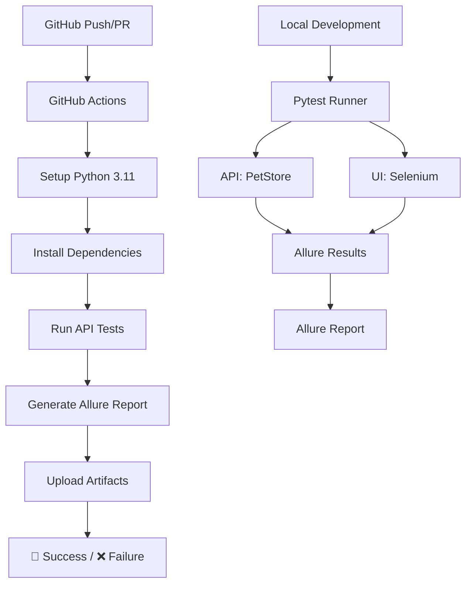

# 🧪 QA Automation Portfolio

<div align="center">
  


**Профессиональный набор автоматизированных тестов QA Engineer**


</div>

## 📋 Оглавление
- [🚀 Быстрый старт](#-быстрый-старт)
- [📊 Что реализовано](#-что-реализовано)
- [🏗️ Архитектура проекта](#️-архитектура-проекта)
- [🎯 Ключевые особенности](#-ключевые-особенности)
- [📈 Примеры отчётов](#-примеры-отчётов)
- [🛠 Технологический стек](#-технологический-стек)
- [📁 Структура проекта](#-структура-проекта)
- [🤝 Контакты](#-контакты)

## 🚀 Быстрый старт

### 1️⃣ Локальный запуск
```bash
# 1. Клонировать репозиторий
git clone https://github.com/<ТВОЙ_USERNAME>/QA.git
cd QA

# 2. Установить зависимости
pip install -r requirements.txt

# 3. Запустить API тесты
pytest -v --alluredir=allure-results

# 4. Сгенерировать отчёт
allure generate allure-results -o allure-report --clean
allure open allure-report
```

### 2️⃣ Запуск в Docker
```bash
# Собрать образ и запустить тесты
docker build -t qa-tests .
docker run --rm -v $(pwd)/allure-report:/app/allure-report qa-tests
```

### 3️⃣ Просмотр результатов CI/CD
1. Перейдите на вкладку **Actions** в репозитории
2. Выберите последний успешный workflow
3. Скачайте артефакт **allure-report** для просмотра отчёта тестирования API

## 📊 Что реализовано

### ✅ **API тестирование (13 тестов)**
| Модуль | Эндпоинты | Тестов | Статус |
|--------|-----------|--------|--------|
| **Pet API** | `POST/GET/PUT/DELETE /pet` | 8 | ✅ |
| **Store API** | `POST/GET/DELETE /store/order` | 3 | ✅ |
| **User API** | `POST/GET /user` | 1 | ✅ |

### 🖥️ **UI тестирование (21 тест)**
| Страница | Тестов | Технология |
|----------|--------|------------|
| [the-internet.herokuapp.com](https://the-internet.herokuapp.com) | 21 | Selenium WebDriver |

### 🔄 **CI/CD Pipeline**
- **Автоматический запуск** тестов при каждом push/pull request
- **Генерация Allure отчётов** с историей запусков
- **Артефакты сборки** для скачивания результатов

## 🏗️ Архитектура проекта



## 🎯 Ключевые особенности

### 🧪 **Комплексное покрытие тестами**
- **Положительные и негативные сценарии**
- **Валидация ответов** (статус коды, схемы JSON)
- **Автоматическая очистка** тестовых данных
- **Параметризованные тесты** для разных статусов

### 📊 **Профессиональные отчёты**
- **Allure Framework** с графиками и историей
- **Группировка тестов** по эпикам, фичам, стори
- **Вложения** (JSON запросы/ответы, скриншоты)
- **Метрики производительности**

### 🔧 **Надёжная инфраструктура**
- **Изоляция тестов** через Docker
- **Повторные попытки** для флакки-тестов
- **Генерация тестовых данных** через Faker
- **Конфигурация через переменные окружения**

## 📈 Примеры отчётов


### 🎨 **Визуализация результатов**
| График | Описание |
|--------|----------|
| **📈 Тренды** | История прохождения тестов по запускам |
| **📋 Категории** | Распределение по severity (Blocker, Critical, Normal) |
| **⏱️ Тайминги** | Время выполнения каждого теста |
| **🧩 Группировки** | Тесты по фичам и стори |

## 🛠 Технологический стек

| Категория | Технологии |
|-----------|------------|
| **Язык/Фреймворк** | Python 3.11, Pytest 7.4.4 |
| **API тестирование** | Requests, Allure-Pytest |
| **UI тестирование** | Selenium 4, WebDriver Manager |
| **Отчётность** | Allure Framework, Pytest-HTML |
| **CI/CD** | GitHub Actions, Docker |
| **Утилиты** | Faker, Python-dotenv, Retrying |
| **Мониторинг** | Allure History, Custom Logging |


## Структура Проекта


## 🤝 Контакты

<div align="center">

**Григорий Захаров**  
QA Automation Engineer//Fullstack dev

[](mailto:zakharov9933@gmail.com)
[](https://github.com/GrigoryZakharov)
[](https://www.linkedin.com/in/grigory-zakharov-577561389/)

</div>

---

<div align="center">
  
⭐ **Если этот проект был полезен, поставь звезду на GitHub!** ⭐

</div>
